# Helpa Codebase Audit & Architecture Baseline

**Document Version:** 1.0.0  
**Repository:** `imsusanta/wacrm_susanta`  
**Product:** Helpa — WhatsApp AI Receptionist & Patient Engagement CRM  
**Target Environment:** Next.js 16 (App Router), React 19, Appwrite Postgres/Auth/Storage/RLS, Meta WhatsApp Cloud API

---

## 1. Executive Summary

Helpa has evolved from the upstream open-source `wacrm` foundation into a specialized, healthcare-adjacent WhatsApp AI Receptionist and patient management platform designed for Indian clinics, diagnostic centers, and service businesses.

While the core architecture contains strong primitives (AES-256-GCM token encryption, PostgreSQL Row Level Security on all core tables, HMAC-SHA256 fail-closed webhook signature verification, and modular industry configurations), a rigorous audit identified several **critical P0 and P1 gaps** that prevent reliable production deployment and trustworthy clinic operation:

1. **Public CDN Caching Risk (P0)**: The `next.config.ts` cache policy applied `public, s-maxage=300` to non-API paths, risking edge proxy caching of rendered dashboard HTML containing patient names and appointment details.
2. **Deployment Failure (P0)**: The appwrite-sites deployment returns `DEPLOYMENT_NOT_FOUND` due to missing deployment configuration, unlinked domain routing, and absent centralized environment validation.
3. **Sensitive Error & Data Leakage (P0)**: Several API routes (`/api/patients/upload-pdf`, `/api/patients/search`) leaked raw error strings or lacked strict role-based access control gates.
4. **Healthcare Data & Document Protection (P0)**: Patient documents, appointment tickets, and lab reports require cryptographically signed, short-lived URLs bound to tenant and resource IDs rather than permanently public bucket access.
5. **Brand & Product Inconsistency (P1)**: The public landing page and documentation still contain upstream generic CRM template copy rather than a focused, credible clinic-first AI receptionist value proposition.

---

## 2. Architecture & Data Flow Diagram

```mermaid
flowchart TD
    subgraph ClientLayer["Client & Edge Layer"]
        Patient["Patient (WhatsApp App)"]
        ClinicStaff["Clinic Staff / Doctor (Web Browser)"]
        EdgeCDN["appwrite-sites Edge / CDN (Security Headers, CSP, No-Store)"]
    end

    subgraph AppLayer["Next.js 16 App Router (Server-Side)"]
        Proxy["Middleware Proxy (src/proxy.ts) - Default-Deny"]
        WebhookAPI["POST /api/whatsapp/webhook (HMAC Fail-Closed & Idempotent)"]
        HealthAPI["GET /api/health (Diagnostic & Status)"]
        ApptAPI["Appointments & Lab Reports API (Role-Gated)"]
        AIOrchestrator["AI Receptionist Engine (OpenRouter/Gemini + Context)"]
        DocGenerator["jsPDF & Signed Token Generator"]
        Logger["Redacting Structured JSON Logger"]
    end

    subgraph ExternalServices["External APIs"]
        MetaAPI["Meta WhatsApp Cloud API (Graph v21.0)"]
        OpenRouter["OpenRouter AI Gateway (Gemini 2.0 Flash)"]
    end

    subgraph DataLayer["Appwrite Backend (Postgres + Storage + Auth)"]
        PostgresDB[(PostgreSQL Database + RLS)]
        Storage[(Appwrite Storage: chat-media, avatars, documents)]
        AppwriteAuth[Appwrite Auth & Session Engine]
    end

    Patient <-->|Inbound/Outbound Messages| MetaAPI
    MetaAPI <-->|Webhook Event / REST Send| WebhookAPI
    WebhookAPI -->|Idempotency & Dead Letter| PostgresDB
    WebhookAPI --> AIOrchestrator
    AIOrchestrator -->|Inference Query| OpenRouter
    AIOrchestrator -->|Dispatch Response| MetaAPI

    ClinicStaff <-->|HTTPS Session| EdgeCDN
    EdgeCDN <--> Proxy
    Proxy <--> AppwriteAuth
    Proxy <--> ApptAPI
    ApptAPI <-->|RLS Scoped Queries| PostgresDB
    ApptAPI --> DocGenerator
    DocGenerator -->|Signed Link| Patient

    AppLayer --> Logger
```

---

## 3. Dependency Overview

| Package                 | Version             | Purpose                                    | Security & Audit Notes                       |
| ----------------------- | ------------------- | ------------------------------------------ | -------------------------------------------- |
| `next`                  | `16.2.6`            | App Router, Server Actions, Route Handlers | Turbopack compilation; CSP headers enforced  |
| `react` / `react-dom`   | `19.2.4`            | UI component rendering                     | Standard React 19 hooks and SSR              |
| `@appwrite/appwrite-js` | `^2.107.0`          | Database, Auth, and Storage client         | Used via typed client and server SSR cookies |
| `@appwrite/ssr`         | `^0.10.3`           | Cookie-based session management            | Default-deny proxy session handling          |
| `tailwindcss`           | `^4.0.0`            | Styling system                             | CSS variables and design tokens              |
| `jspdf` / `qrcode`      | `^4.2.1` / `^1.5.4` | Digital OPD Ticket Generation              | Server-side PDF & barcode generation         |
| `@xyflow/react`         | `^12.11.0`          | Visual flow builder                        | Gated to advanced automation users           |
| `lucide-react`          | `^1.18.0`           | Iconography                                | High-contrast accessible UI elements         |
| `vitest`                | `^4.1.9`            | Unit and integration test runner           | Fast in-memory execution across 38 suites    |
| `playwright`            | `^1.50.0`           | End-to-end browser automation              | Critical customer journey verification       |

---

## 4. Feature Inventory: Inherited vs Helpa-Specific

### A. Inherited from Upstream wacrm

- Base Meta WhatsApp webhook ingestion and signature validation structure.
- Core contact deduplication logic (`findExistingContact`) and CSV parsing.
- Conversation message feed and status tracking (`sent`, `delivered`, `read`, `failed`).
- Basic visual automation flow engine and canvas.
- Multi-user account membership structure (`owner`, `admin`, `agent`, `viewer`).

### B. Custom Helpa-Specific Implementation

- **Hospital & Clinic Module**: Doctor scheduling, consultation fees, OPD queue tokens (`TKT-XXX`), patient sequence numbering (`PAT-XXXXXX`).
- **Digital Appointment Tickets**: Cryptographically signed OPD PDF slips with verification QR codes.
- **Lab Reports & Document Dispatch**: Direct pathology report dispatch via WhatsApp with automatic blood group detection.
- **AI Clinic Receptionist**: Context injection combining knowledge base, clinic hours, doctor rosters, and active patient history.
- **Hardened Security & Reliability**: Fail-closed Meta webhook signatures, durable event idempotency registry, dead-letter queue, and structured JSON observability logging with PII sanitization.

---

## 5. Risk Register & Categorized Findings

### Priority 0 (P0) — Critical Security, Isolation & Deployment Blockers

- **SEC-01 (CDN Cache Leakage)**: `next.config.ts` cache headers specified `public, s-maxage=300` for all non-API paths. If an authenticated user views `/inbox` or `/dashboard`, a public edge proxy could cache and serve private patient conversations to subsequent anonymous users. **Fix:** Ensure all authenticated dashboard pages receive `private, no-store`.
- **SEC-02 (appwrite-sites Deployment Broken)**: Production domain `https://wacrm-susanta.www.helpa.studio` returns `DEPLOYMENT_NOT_FOUND`. Missing centralized environment validation causes silent runtime boot failures. **Fix:** Create `/api/health`, validate required env vars at boot, and document production deployment runbooks.
- **SEC-03 (API Error & PHI Leakage)**: Certain API routes return raw error strings (`err.message`) in HTTP 500 responses, exposing database table names and stack traces. **Fix:** Standardize on `toErrorResponse()` across all routes.
- **SEC-04 (Document Access Controls)**: Media uploaded to storage buckets must not be permanently public without access token verification. **Fix:** Ensure signed short-lived URLs with cryptographic verification are enforced on patient PDF downloads.

### Priority 1 (P1) — Critical Reliability, Authorization & Customer Journeys

- **AUTH-01 (Vertical Module Gating)**: Ensure non-clinic accounts cannot invoke hospital-specific API routes without active module permissions.
- **REL-01 (Centralized Environment Validation)**: Divide variables into public, server-only, and optional with fail-fast validation that never exposes secrets in logs.
- **UX-01 (Clinic-First Landing Page)**: Rewrite landing page and brand assets to focus strictly on clinic owners, receptionists, and patient booking outcomes rather than developer template code.
- **TEST-01 (Automated Cross-Tenant Tests)**: Expand test suite to explicitly assert cross-account boundary rejections and viewer-role write restrictions.

### Priority 2 (P2) — Performance, Accessibility & Code Quality

- **A11Y-01 (WCAG 2.2 AA Compliance)**: Verify keyboard focus trapping in dialogs, visible focus rings, high-contrast color tokens, and aria-labels on icon buttons.
- **PERF-01 (Turbopack Optimization)**: Eliminate unnecessary client components and ensure smooth offline/sandboxed build compatibility.
- **DOCS-01 (Architecture & Operations Guides)**: Publish complete `docs/ARCHITECTURE.md`, `docs/SECURITY.md`, `docs/DEPLOYMENT.md`, `docs/OPERATIONS.md`, and `docs/TESTING.md`.

---

## 6. Recommended Implementation Sequence

1. **Phase 1: Security & Route Protection Baseline**
   - Correct CDN caching headers in `next.config.ts` (`private, no-store` for authenticated routes).
   - Standardize error handling and eliminate any raw error leakage across API endpoints.
   - Enforce centralized environment validation (`src/lib/env.ts`).
2. **Phase 2: Health Monitoring & Deployment Readiness**
   - Implement `GET /api/health` with bounded dependency checks.
   - Create comprehensive `docs/DEPLOYMENT.md` and `docs/OPERATIONS.md`.
3. **Phase 3: Multi-Tenant Authorization & Storage Hardening**
   - Verify server-side role gating and tenant scoping on all API endpoints.
   - Add automated test suites for cross-account boundary protection and role enforcement.
4. **Phase 4: Clinic-First Product & UX Refinement**
   - Polish clinic onboarding flow, inbox reception panel, and appointment workflows.
   - Update landing page with trustworthy, clinic-focused copy and honest pricing.
5. **Phase 5: Quality, Accessibility & E2E Test Suite**
   - Execute unit, integration, and Playwright E2E suites.
   - Verify 0 ESLint errors, 0 TypeScript errors, 100% test pass rate, and green Next.js build.
