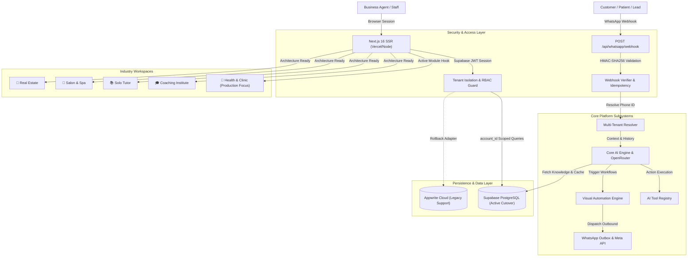
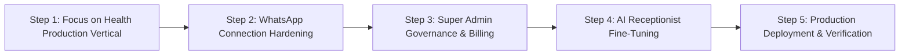

# HELPA — Architectural Audit & Strategic Blueprint

**Helpa Studio** • Comprehensive Codebase Inspection & Modernization Plan

---

## 1. Executive Summary & Current Architecture

**Helpa** is an AI-powered business communication platform and multi-tenant CRM built on Next.js 16 and TypeScript, engineered to automate customer and patient interactions via the official Meta WhatsApp Business Cloud API.

### Current Architectural Overview



---

## 2. Core Modules vs. Industry Modules Breakdown

To establish a clean, scalable platform architecture without code duplication or industry pollution in core logic, the system is separated into **Core Platform Subsystems** and **Plug-and-Play Industry Modules**.

```
┌────────────────────────────────────────────────────────────────────────────────────────┐
│                                 HELPA CORE PLATFORM                                    │
│  Auth • Tenants • Workspace Engine • WhatsApp Cloud API • Unified Inbox • Contacts     │
│  Dual AI Engine • OpenRouter • Knowledge Base • Automations • Campaigns • Billing     │
│  Super Admin • RBAC Permissions • Rate Limiter • Security & Sanitizer • Event Bus      │
└──────────────────────────────────────────┬─────────────────────────────────────────────┘
                                           │ Dynamic Manifest Binding
               ┌───────────────────────────┴───────────────────────────┐
               ▼                                                       ▼
┌──────────────────────────────┐                       ┌──────────────────────────────┐
│     HEALTH & CLINIC          │                       │   FUTURE INDUSTRY MODULES    │
│  (Production Focused)        │                       │   (Architecture-Ready)       │
│  • Patient IDs (PT-XXXXXX)   │                       │  • Coaching (Admissions)     │
│  • Doctor Rosters & Slots    │                       │  • Solo Tutor (Batches)      │
│  • Signed OPD PDF Slips      │                       │  • Salon (Stylists & Menu)   │
│  • Pathology Report Dispatch │                       │  • Real Estate (Properties)  │
└──────────────────────────────┘                       └──────────────────────────────┘
```

### A. What Belongs in Core Platform

1. **Authentication & Session Security**: Supabase SSR authentication with HttpOnly cookies and role validation.
2. **Multi-Tenant Scoping**: Database-level tenant isolation (`account_id`), workspace members (`account_members`), and tenant switching.
3. **WhatsApp Communication Engine**: Official Meta Cloud API integration, 1-Click Embedded Signup, message outbox queue, template manager, and webhook verification.
4. **Unified Multi-Agent Inbox**: Real-time conversation threads, human takeover toggle, internal notes, media viewing, and read receipts.
5. **Universal Contacts CRM**: Contact records, custom tags, message history, and activity timeline.
6. **Core AI Engine & Copilot**: OpenRouter inference provider, context builder, short-term conversational memory, and function tool execution.
7. **Knowledge Base System**: Account-level custom FAQs and document uploads for semantic prompt grounding.
8. **Campaign Broadcast Engine**: Tag-based bulk WhatsApp messaging with template variable interpolation.
9. **Visual Workflow Automation**: Node-based automation canvas for triggers (`message_received`, `appointment_booked`) and outbound actions.
10. **SaaS Billing & Quotas**: Tiered subscription management (`Starter`, `Professional`, `Business`, `Enterprise`), usage metering, and payment reconciliation.
11. **Super Admin Platform**: Cross-tenant monitoring, plan editing, rate limit overrides, and system telemetry.

### B. What Belongs in Industry Modules

1. **Health & Clinic Module** (_Primary Production Vertical_):
   - Sequential Patient IDs (`PT-XXXXXX`) and demographic profiles.
   - Doctor rosters, specializations, consultation hours, and slot conflict management.
   - HMAC-SHA256 signed digital OPD consultation slips with embedded check-in QR codes.
   - Pathology report status tracking and WhatsApp notification dispatch.
2. **Coaching Institute Module**: Admissions pipeline (10 stages), batch capacities, course fee schedules.
3. **Solo Tutor Module**: Independent teacher workspace, student homework assignments, doubt threads.
4. **Salon & Spa Module**: Service catalog, stylist rosters, repeat booking retention sequences.
5. **Real Estate Module**: Property listings, buyer requirements matching, site visit schedules.

---

## 3. Detailed Audit of the 26 Inspection Areas

### 1. Project Structure

- **State**: Clean, modular structure using Next.js 16 App Router.
- **Directories**:
  - `src/app/`: Next.js page routes, layouts, and REST API route handlers.
  - `src/core/`: Industry-agnostic platform infrastructure (AI, WhatsApp, Auth, Billing, Security).
  - `src/modules/`: Industry workspace definitions (`health`, `coaching`, `solo-teacher`, `salon`, `real-estate`).
  - `src/components/`: Reusable UI components (landing, inbox, kanban, settings, dashboard).
  - `src/lib/`: Low-level utilities (encryption, rate-limiting, currency, Supabase/Appwrite clients).
  - `supabase/migrations/`: Deterministic PostgreSQL migration scripts with RLS policies.

### 2. Frontend Architecture

- **State**: React 19 Client Components (`'use client'`) for interactive widgets; React Server Components for metadata and layouts.
- **State Management**: React hooks (`useAuth`, `useWorkspace`, `useTotalUnread`), URL query params for filters, and toast notifications (`sonner`).
- **Styling**: Tailwind CSS with customized color schemes and full Dark/Light theme toggle support.

### 3. Backend Architecture

- **State**: Server-side Next.js route handlers (`/api/*`) executing Node.js runtimes.
- **Design Pattern**: Controller-Service-Repository architecture with universal ORM compatibility layer (`src/lib/appwrite-server-compat.ts`).

### 4. Database Schema

- **State**: 13 Core PostgreSQL tables defined in `supabase/migrations/`:
  - `accounts`, `profiles`, `account_members`
  - `contacts`, `conversations`, `messages`
  - `whatsapp_configs`, `whatsapp_outbox`, `webhook_events`
  - `appointments`, `reminder_jobs`, `audit_logs`, `migration_identity_map`
  - Plus industry extension tables: `hospital_doctors`, `hospital_departments`, `hospital_lab_reports`, `plans`, `subscriptions`.
- **Integrity**: Strict foreign key constraints and indexes on `(account_id, created_at)`.

### 5. Authentication & Session Management

- **State**: Production cutover active on Supabase SSR Auth with secure, HttpOnly, SameSite cookies.
- **Fallback**: Legacy Appwrite authentication preserved as non-destructive rollback adapter (`MIGRATION_MODE=rollback`).

### 6. Multi-Tenancy

- **State**: Shared database with logical isolation.
- **Enforcement**:
  - API level: `assertTenantOwnership` in `src/core/security/tenant-guard.ts`.
  - Database level: PostgreSQL Row Level Security (RLS) policies scoped to `auth.uid() -> account_members.account_id`.

### 7. Workspace System

- **State**: Dynamic industry manifest resolution in `src/modules/registry.ts` and `src/hooks/use-workspace.ts`.
- **Capability**: Switches navigation routes, dashboard cards, terminology, and AI prompts based on the account's selected industry.

### 8. WhatsApp Integration & Meta Cloud API

- **State**: Native Meta Cloud API v20.0+ integration.
- **Capabilities**:
  - Dual-mode support: 1-Click Meta Embedded Signup & WAHA QR code session fallback.
  - Two-way messaging: Text, interactive buttons, list messages, document attachments, and templates.
  - Outbox queue (`src/lib/whatsapp/outbox-service.ts`) with exponential backoff retry.

### 9. Webhooks & Idempotency

- **State**: `POST /api/whatsapp/webhook` with fail-closed HMAC-SHA256 signature verification (`X-Hub-Signature-256` checked against `META_APP_SECRET`).
- **Tenant Resolution**: Inbound payloads resolve tenant account via `phone_number_id` (`src/core/whatsapp/tenant-resolver.ts`).

### 10. AI Engine & OpenRouter

- **State**: Flexible multi-model AI provider (`src/core/ai/provider.ts`) connecting to OpenRouter.
- **Tools Registry**: Modular AI tools (`src/core/ai/tools.ts`) for appointment booking, clinic hours lookup, doctor lookup, and patient search.

### 11. Knowledge Base & Context Grounding

- **State**: Account-scoped document and FAQ repository (`src/core/knowledge/index.ts`). Injected directly into the AI system prompt dynamically.

### 12. AI Conversational Memory

- **State**: Short-term memory buffer (`src/core/ai/memory.ts`) maintaining recent message turns, detected intent, lead qualification scores, and conversation summaries.

### 13. Unified Team Inbox

- **State**: Real-time multi-agent messaging inbox (`src/app/(dashboard)/inbox/`).
- **Features**: Live conversation switching, agent takeover toggle, quick canned replies, media attachments, and internal customer notes.

### 14. Contacts & Patient Management

- **State**: Unified contacts repository (`src/core/contacts/index.ts`). Maps dynamically to Patients in Health workspaces and Leads/Students in other workspaces.

### 15. Campaigns & Broadcasts

- **State**: Bulk broadcast messaging engine (`src/app/(dashboard)/broadcasts/`). Supports Meta approved templates, tag filters, variable substitution, and delivery status logs.

### 16. Automations & Visual Workflow Builder

- **State**: Interactive drag-and-drop canvas (`src/app/(dashboard)/automations/`) for building trigger-action flows (`message_received`, `keyword_matched`, `status_changed`).

### 17. Appointments & Scheduling Engine

- **State**: Slot-based calendar system (`src/app/(dashboard)/appointments/`). Conflict avoidance algorithms prevent double-booking across doctors and treatment rooms.

### 18. Health Module (Clinical Vertical)

- **State**: Production-ready clinical workflow engine (`src/modules/health/`):
  - Sequential Patient ID generator (`PT-XXXXXX`).
  - Doctor schedules & department allocations.
  - HMAC-signed OPD tickets with QR codes and strict private cache headers.
  - Pathology lab report notifications via WhatsApp.

### 19. SaaS Billing & Monetization

- **State**: Multi-tier subscription management (`src/core/billing/`):
  - 4 Plan tiers (`Starter`, `Professional`, `Business`, `Enterprise`).
  - Usage metering for WhatsApp messages, AI requests, contacts, and team seats.
  - Live synchronization between Admin Panel plans and Landing Page pricing cards.

### 20. Super Admin Platform

- **State**: Centralized control center (`src/app/(dashboard)/admin/`):
  - Account list with member counts, active subscriptions, and message volume telemetry.
  - Dynamic plan editor and system settings manager.
  - Gated server-side to verified super admin accounts (`susantalohr@gmail.com`).

### 21. Permissions & RBAC

- **State**: 4-Tier role hierarchy (`owner` > `admin` > `staff` > `viewer`) enforced via server guards in `src/lib/auth/account.ts`.

### 22. Security & Compliance Safeguards

- **State**:
  - **AES-256-GCM** encryption for access tokens at rest.
  - **PII/PHI Sanitizer**: Automatic phone number masking (`+91******1234`) and credential stripping in logs.
  - **Private No-Store Headers**: `Cache-Control: private, no-store, no-cache, must-revalidate` on clinical and authenticated routes.
  - **Sliding-Window Rate Limiters**: 5/min on auth, 10/min on patient export, 100/min on outbound WhatsApp messages.

### 23. Testing & QA Infrastructure

- **State**: **83 Vitest suites (746 tests)** passing in ~5.0s, including unit, module, regression, and tenant isolation tests.

### 24. Production Configuration

- **State**: Next.js 16.3 standalone build with build metadata embedding (`commit=936f59b`), Supabase PostgreSQL integration, and verified Docker/Vercel compatibility.

### 25. Design System & UX Polish

- **State**: High-converting Kommo-style landing page with interactive 4-category product switcher, floating social proofs, responsive navigation, and custom 404 error experience.

---

## 4. Current State vs. Recommended Architecture

| Component                    | Current State                                                           | Recommended Target Architecture                                                        | Priority |
| :--------------------------- | :---------------------------------------------------------------------- | :------------------------------------------------------------------------------------- | :------: |
| **Industry Workspaces**      | Health fully implemented; 4 other modules have services/stubs.          | Keep Health as primary production focus; maintain clean interfaces for future modules. |   High   |
| **Landing Page Sync**        | Dynamically loads live plans from `/api/plans` with offline fallback.   | Retain dynamic API connection with CDN edge caching (SWR).                             |  Medium  |
| **Database Abstraction**     | Unified ORM adapter supports PostgreSQL (Supabase) + Appwrite fallback. | Standardize fully on Supabase PostgreSQL while keeping rollback safety.                |   High   |
| **WhatsApp Embedded Signup** | Meta SDK popup exchange with AES-256-GCM token storage.                 | Add automated phone number healthcheck probe every 6 hours.                            |  Medium  |
| **OPD & Report Slips**       | Cryptographically signed HMAC-SHA256 short-lived PDF download links.    | Add optional password protection (last 4 digits of patient phone) on PDFs.             |   Low    |

---

## 5. Security & Privacy Audit Findings

1. **Zero Credential Leaks**: Gitleaks secret detection integrated into CI; no raw tokens or API keys logged.
2. **Deterministic Multi-Tenant Guards**: All mutating API endpoints require server-validated `accountId` from user JWT session.
3. **Fail-Closed Webhook Verification**: Inbound WhatsApp webhooks reject unsigned or invalidly signed payloads.
4. **PHI Redaction**: Patient names, medical notes, and phone numbers are scrubbed from telemetry logs.
5. **No-Store Headers**: Enforced across all authenticated and patient document routes.

---

## 6. Technical Debt & Cleanup Opportunities

1. **Stale Industry Stubs**: Remove legacy placeholders (`hospital/`, `gym/`, `restaurant/`, `travel/` stubs in `src/modules/`) to keep the codebase lean and focused on the 5 core verticals (`health`, `coaching`, `solo-teacher`, `salon`, `real-estate`).
2. **Vite Config Warning**: Update `vitest.config.ts` extension to `.mjs` or ensure type alignment to silence Vite configLoader deprecation notices.

---

## 7. Recommended Step-by-Step Implementation Roadmap



1. **Phase A (Health Vertical Hardening)**: Ensure all clinic scheduling, doctor rosters, patient records, and OPD ticket workflows operate with 100% reliability.
2. **Phase B (WhatsApp Reliability & Monitoring)**: Provide automated webhook health status and reconnect triggers in the settings dashboard.
3. **Phase C (Super Admin & Billing Operations)**: Validate payment webhooks, invoice generation, and tier upgrade workflows.
4. **Phase D (AI Receptionist Accuracy)**: Continuously evaluate conversational intents, context grounding from the Knowledge Base, and human agent takeover transitions.
