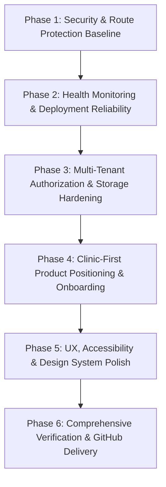

# Helpa Production Readiness Implementation Plan

**Branch:** `feat/helpa-production-readiness`  
**Quality Target:** Verified 10/10 Production-Grade Healthcare SaaS  
**Verification Checklist:** Strict ESLint (`0 errors`), TypeScript (`tsc --noEmit` 0 errors), Vitest (`448+ tests passing`), Next.js Production Build (`Compiled successfully`).

---

## 1. Phased Execution Roadmap

---

## 2. Phase Breakdown

### Phase 1: Security & Route Protection Baseline (P0)

- **1.1 CDN Cache Policy Hardening**: Update `next.config.ts` so that authenticated application paths (`/dashboard`, `/inbox`, `/contacts`, `/settings`, `/appointments`, etc.) explicitly receive `Cache-Control: private, no-store`. Only truly static assets (`/_next/static/*`) and the public marketing landing page receive edge caching.
- **1.2 Standardized API Error Handling**: Replace all instances of `catch (err: any)` returning raw `err.message` in 500 status codes with `toErrorResponse(err)`, preventing database table and column schema enumeration.
- **1.3 Centralized Environment Validator**: Create `src/lib/env.ts` to validate required environment variables at boot with clear diagnostic messages, preventing runtime panic while never logging secret keys.

### Phase 2: Health Monitoring & Deployment Reliability (P0)

- **2.1 Production Health Endpoint**: Implement `src/app/api/health/route.ts` returning service status, timestamp, and bounded dependency checks without exposing internal versions or secrets.
- **2.2 Deployment Documentation**: Create `docs/DEPLOYMENT.md` detailing step-by-step production deployment for appwrite-sites, Node.js VPS, and Hostinger, with required environment variable setup and Appwrite migration guides.

### Phase 3: Multi-Tenant Authorization & Storage Hardening (P0 / P1)

- **3.1 Server-Side Feature & Module Gating**: Ensure direct API access enforces active tenant module permissions (e.g. `/api/appointments/*` and `/api/patients/*` verify that the account has clinical modules enabled).
- **3.2 Automated Cross-Account Penetration Tests**: Add tests verifying that Account A cannot access Account B contacts, messages, appointments, or pathology reports even if resource IDs are known.
- **3.3 Storage Access Token Verification**: Ensure document downloads enforce HMAC-signed short-lived tokens and log access events without exposing patient PII.

### Phase 4: Clinic-First Product Positioning & Onboarding (P1)

- **4.1 Clinic Onboarding Experience**: Polish the step-by-step clinic onboarding flow (clinic profile, doctors & OPD schedules, Meta WhatsApp credentials, AI reception rules, test message verification).
- **4.2 Landing Page Rewrite**: Update `src/app/page.tsx` with focused clinic positioning: "Helpa — WhatsApp AI Receptionist & Patient Engagement CRM for Clinics & Hospitals", highlighting 24/7 automated appointment booking, digital OPD slips, and pathology report dispatch.

### Phase 5: UX, Accessibility & Design System Polish (P2)

- **5.1 WCAG 2.2 AA Accessibility**: Implement visible focus states, dialog focus trapping, high-contrast text ratios, and aria-labels across the inbox composer, receptionist copilot, and table actions.
- **5.2 Empty & Error States**: Provide calm, trustworthy empty states and actionable error boundaries across all dashboard pages.

### Phase 6: Quality Verification & Supply-Chain Hardening

- **6.1 Documentation Package**: Deliver `docs/ARCHITECTURE.md`, `docs/SECURITY.md`, `docs/DEPLOYMENT.md`, `docs/OPERATIONS.md`, `docs/TESTING.md`, and an updated `README.md` with transparent MIT attribution to upstream `wacrm`.
- **6.2 Five-Gate CI Verification**: Run format check, strict lint (`0 errors`), TypeScript typecheck (`0 errors`), test suite (`448+ passing`), and production Next.js build.
