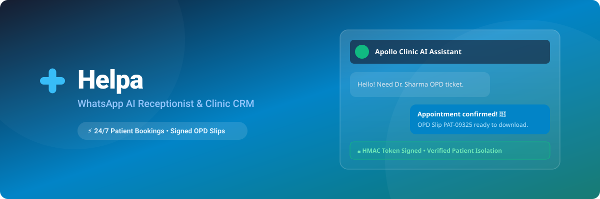
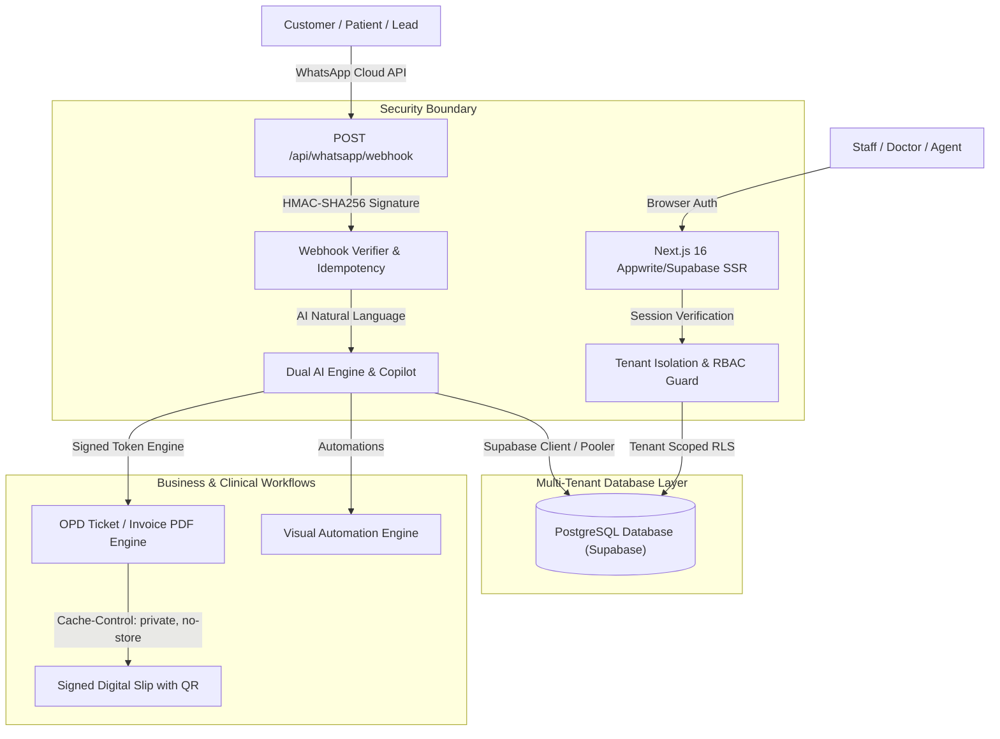

# Helpa — AI Business Communication Platform & CRM

> **Helpa** by Helpa Studio is a production-grade, multi-tenant AI business communication platform and CRM. Built for clinics, doctors, coaching institutes, solo tutors, beauty salons, real estate agencies, and modern service businesses. Automate 24/7 customer & patient conversations, book appointments, generate signed digital OPD slips, manage multi-industry pipelines, and orchestrate omnichannel messaging via official Meta WhatsApp Business Cloud API.

<p align="center">
  
</p>

<p align="center">
  <a href="./LICENSE"></a>
  <a href="https://github.com/imsusanta/helpa/releases"></a>
  <a href="https://github.com/imsusanta/helpa/actions/workflows/ci.yml"></a>
  <a href="https://nextjs.org"></a>
  <a href="https://supabase.com"></a>
  <a href="https://www.typescriptlang.org"></a>
</p>

---

## 📐 System Architecture



---

## 🏢 Supported Industry Modules

Helpa provides dynamically customized terminology, navigation, AI tools, and workflows for 5 major verticals:

1. **🏥 Health & Clinic Module**:
   - Sequential Patient IDs (`PT-XXXXXX`), doctor schedules, real-time slot conflict prevention.
   - HMAC-signed OPD consultation slip generation with embedded QR codes.
   - Pathology lab report dispatch & automated WhatsApp follow-up reminders.
2. **🎓 Coaching Institute Module**:
   - 10-stage admission pipeline from `New Enquiry` to `Enrolled`.
   - Course catalog, batch capacity management, automated fee payment alerts.
3. **📚 Solo Tutor / Private Teacher Module**:
   - Focused workspace for independent educators with multi-child parent ambiguity resolution.
   - 24h & 2h class reminder notifications, homework assignments & doubt tracking.
4. **💇 Salon & Beauty Module**:
   - Beauty treatment menus, real-time stylist availability, one-click rescheduling.
   - 30-day retention follow-ups to maximize repeat bookings.
5. **🏢 Real Estate Module**:
   - Sequential Lead IDs (`LEAD-XXXXXX`), budget and property requirement matching.
   - Site visit appointment bookings with automated agent assignments.

---

## 🔒 Security & Data Protection Architecture

1. **Fail-Closed Webhook Verification**: Inbound WhatsApp webhooks on `POST /api/whatsapp/webhook` enforce constant-time HMAC-SHA256 signature verification with `WHATSAPP_APP_SECRET`.
2. **Encrypted Credentials at Rest**: Meta Cloud API tokens and third-party keys are encrypted using **AES-256-GCM** authenticated encryption with NIST-approved 16-byte authentication tags.
3. **Strict Multi-Tenant Isolation**: Server-side tenant guards verify that every database mutation is scoped strictly to the authenticated `account_id`. Foreign resource access attempts are denied with `403 Forbidden` and logged.
4. **Signed Document Access**: Appointment slips, invoices, and lab reports are protected by short-lived HMAC-SHA256 tokens with configurable expiration timestamps.
5. **PII & PHI Redaction**: The structured logger automatically sanitizes patient names, medical notes, phone numbers (`+91******1234`), passwords, and bearer tokens from telemetry.
6. **Strict No-Store Cache Policy**: Authenticated dashboard and clinical routes enforce `Cache-Control: private, no-store` to prevent public CDN or edge caching.

> [!NOTE]
> **Compliance Notice**: Helpa is engineered to support compliance-readiness (including India DPDP Act and HIPAA technical safeguards when deployed within appropriate HIPAA Business Associate / DPDP compliant infrastructure). Independent clinical legal audit is recommended prior to healthcare production deployment.

---

## 🗄️ Database & Provider Architecture

- **Active Production Database**: **Supabase (PostgreSQL 15+)** with deterministic SQL migrations, row-level security (RLS), and JWT session verification.
- **Provider Abstraction**: A unified server compatibility layer (`src/lib/appwrite-server-compat.ts`) abstracts data operations, allowing seamless cutover with legacy Appwrite rollback capabilities.

---

## 🚀 Quick Start & Development

### 1. Clone & Install

```bash
git clone https://github.com/imsusanta/helpa.git
cd helpa
npm ci
```

### 2. Configure Environment

Copy `.env.local.example` to `.env.local` and configure your API keys:

```bash
cp .env.local.example .env.local
```

Key environment variables:

```env
AUTH_PROVIDER="supabase"
DATABASE_PROVIDER="supabase"
MIGRATION_MODE="cutover"
NEXT_PUBLIC_SUPABASE_URL="https://your-project.supabase.co"
NEXT_PUBLIC_SUPABASE_ANON_KEY="your-supabase-anon-key"
SUPABASE_SERVICE_ROLE_KEY="your-supabase-service-role-key"
ENCRYPTION_KEY="32_byte_hex_key"
WHATSAPP_APP_SECRET="your_meta_app_secret"
```

### 3. Run Quality Gates

```bash
npm run format:check     # Prettier formatting verification
npm run lint             # Strict ESLint check (0 warnings allowed)
npm run typecheck        # TypeScript strict type validation
npm test                 # Vitest unit & regression suites
npm run test:integration # Tenant-isolation & security tests
npm run supabase:validate# Validate database migrations manifest
npm run build            # Next.js 16 production compilation
```

---

## 📖 Upstream Attribution

Helpa is developed by **Helpa Studio** and is based on the MIT-licensed [wacrm](https://github.com/ArnasDon/wacrm) project by [ArnasDon](https://github.com/ArnasDon). It extends the core architecture with multi-industry modules, 1-click Meta Embedded Signup, Super Admin control center, SaaS billing, security hardening, and clinical healthcare workflows.
