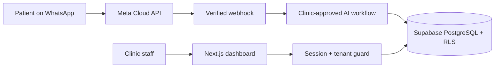

# Helpa — WhatsApp AI receptionist for clinics

> Turn patient messages into confirmed appointments while keeping clinic staff in control.

[](https://github.com/imsusanta/helpa/actions/workflows/ci.yml)
[](https://github.com/imsusanta/helpa/actions/workflows/coverage.yml)
[](https://github.com/imsusanta/helpa/actions/workflows/codeql.yml)
[](https://github.com/imsusanta/helpa/actions/workflows/post-deploy.yml)
[](./LICENSE)

<p align="center">
  
</p>

## Clinic workflow

Helpa is focused first on independent clinics and outpatient teams in India that manage patient enquiries through WhatsApp.

1. A patient asks a clinic-approved question on WhatsApp.
2. Helpa answers supported intents and checks real doctor availability.
3. The patient chooses a slot and receives confirmation and reminders.
4. Staff can review, assign, or take over the conversation at any time.
5. OPD slips, reports, and follow-up activity remain connected to the patient journey.

## Product proof

- [90-second demo storyboard and seven-shot capture list](./docs/PRODUCT_DEMO.md)
- [Outcome definitions and publication rules](./docs/PRODUCT_METRICS.md)
- [Public roadmap](./ROADMAP.md)

The walkthrough and real authenticated-product screenshots are tracked in [issue #84](https://github.com/imsusanta/helpa/issues/84). They will be added only after a staging capture with fictional patient data; synthetic mockups are not presented as product screenshots.

Production outcomes are not fabricated. Response time, bookings handled, automation success, and patient return rate will be published after instrumentation, validation, consent, and a complete observation window, tracked in [issue #83](https://github.com/imsusanta/helpa/issues/83).

## Security posture

Current safeguards include:

- Meta WhatsApp Cloud API webhook signature verification and idempotency.
- Supabase authentication, PostgreSQL row-level security, and server-side tenant guards.
- Authenticated encryption for sensitive integration credentials.
- Signed, time-limited document access.
- Private no-store caching for authenticated and clinical routes.
- CI secret detection, dependency auditing, security regression tests, and CodeQL analysis.

These are engineering controls, **not a compliance certification**. See the [external security review brief](./docs/EXTERNAL_SECURITY_REVIEW_BRIEF.md) and [issue #81](https://github.com/imsusanta/helpa/issues/81). Helpa should not claim HIPAA, DPDP, or equivalent compliance until independent technical and legal reviews are complete.

## Architecture



- **Application:** Next.js 16, React 19, TypeScript
- **Data and authentication:** Supabase PostgreSQL, SSR auth, RLS
- **Messaging:** Official Meta WhatsApp Business Cloud API
- **Testing:** Vitest and Playwright
- **Deployment verification:** Commit-aware post-deployment health checks

The remaining Appwrite compatibility layer is rollback-only migration code. Its removal requires a dedicated verified cutover and is tracked in [issue #82](https://github.com/imsusanta/helpa/issues/82); deleting it inside an unrelated marketing change would create avoidable data and rollback risk.

## Local development

```bash
git clone https://github.com/imsusanta/helpa.git
cd helpa
npm ci
cp .env.local.example .env.local
npm run dev
```

## Quality gates

```bash
npm run format:check
npm run lint
npm run typecheck
npm test
npm run test:integration
npm run supabase:validate
npm run build
npm run test:e2e
```

CI also produces a downloadable HTML coverage report, blocks high-severity dependency vulnerabilities, scans for secrets, runs CodeQL, and verifies the deployed commit after changes reach `main`.

## Responsible deployment

Do not use production patient data in demos or tests. Before a healthcare production rollout, complete the external review, data-protection assessment, vendor agreements, retention policy, incident-response process, backup/restore testing, and jurisdiction-specific legal review.

## Attribution

Helpa is developed by **Helpa Studio** and is based on the MIT-licensed [wacrm](https://github.com/ArnasDon/wacrm) project by ArnasDon.

## License

[MIT](./LICENSE)
