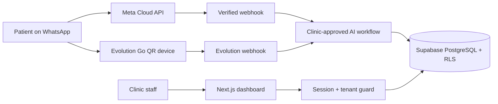

# Helpa — WhatsApp AI receptionist for clinics

> Turn patient messages into confirmed appointments while keeping clinic staff in control.

[](https://github.com/imsusanta/helpa/actions/workflows/ci.yml)
[](https://github.com/imsusanta/helpa/actions/workflows/coverage.yml)
[](https://github.com/imsusanta/helpa/actions/workflows/codeql.yml)
[](https://github.com/imsusanta/helpa/actions/workflows/post-deploy.yml)
[](./LICENSE)

<p align="center">
  
</p>

## Clinic workflow

Helpa is focused first on independent clinics and outpatient teams in India that manage patient enquiries through WhatsApp.

1. A patient asks a clinic-approved question on WhatsApp.
2. Helpa answers supported intents and checks real doctor availability.
3. The patient chooses a slot and receives confirmation and reminders.
4. Staff can review, assign, or take over the conversation at any time.
5. OPD slips, reports, and follow-up activity remain connected to the patient journey.

## Product proof & verification packages

- [90-second demo storyboard and seven-shot capture specification](./docs/PRODUCT_DEMO.md) *(Status: Blocked by human capture)*
- [Outcome definitions, event producers, and aggregation logic](./docs/PRODUCT_METRICS.md) *(Status: Blocked by 30-day observation window)*
- [Appwrite inventory & Supabase cutover verification gates](./docs/APPWRITE_INVENTORY_AND_CUTOVER.md) *(Status: In rollback-safety window)*
- [Independent security assessment handover package](./docs/EXTERNAL_SECURITY_REVIEW_PACKAGE.md) *(Status: Blocked by external assessor)*
- [Public roadmap](./ROADMAP.md)

The 7 core product views and walkthrough specification are defined in [PRODUCT_DEMO.md](./docs/PRODUCT_DEMO.md).

Outcome event producers (`product_outcome_events`) and aggregation calculations are implemented with privacy-safe one-way subject hashing, small cohort suppression, and server-side RLS protection in [src/lib/metrics](./src/lib/metrics), tracked in [PRODUCT_METRICS.md](./docs/PRODUCT_METRICS.md).

## Security posture

Current safeguards include:

- Meta WhatsApp Cloud API webhook signature verification and idempotency.
- Supabase authentication, PostgreSQL row-level security (RLS), and server-side tenant guards.
- Security-invoker views (`whatsapp_configs`, `account_members`) and immutable search-path function hardening.
- Authenticated encryption for sensitive integration credentials.
- Signed, time-limited document access.
- Private no-store caching for authenticated and clinical routes.
- CI secret detection, dependency auditing, security regression tests, and CodeQL analysis.

Detailed security hardening controls, test references, and third-party handover materials are documented in the [External Security Review Package](./docs/EXTERNAL_SECURITY_REVIEW_PACKAGE.md). Helpa uses conservative, evidence-based claims and adheres strictly to Indian healthcare guidelines and data protection practices.

## Architecture



- **Application:** Next.js 16, React 19, TypeScript
- **Data and authentication:** Supabase PostgreSQL, SSR auth, RLS
- **Messaging:** Official Meta WhatsApp Business Cloud API, with optional Evolution Go v0.7.2 QR/linked-device connections (see [Evolution Go integration](./docs/EVOLUTION_GO_INTEGRATION.md))
- **Testing:** Vitest and Playwright
- **Deployment verification:** Commit-aware post-deployment health checks

The remaining Appwrite compatibility layer is rollback-only migration code. Its removal requires a dedicated verified cutover and is tracked in [issue #82](https://github.com/imsusanta/helpa/issues/82); deleting it inside an unrelated marketing change would create avoidable data and rollback risk.

## Local development

Point `.env.local` at any Supabase project and run the dev server:

```bash
git clone https://github.com/imsusanta/helpa.git
cd helpa
npm ci
cp .env.local.example .env.local
npm run dev
```

To bring up a fully self-contained local backend (Docker + local Supabase stack,
schema, and a generated `.env.local`) with no hosted project, run:

```bash
bash scripts/setup-local-supabase.sh
npm run dev
```

This is also what the Cloud Agent environment (`.cursor/environment.json`) uses
on startup.

## Quality gates

```bash
npm run format:check
npm run lint
npm run typecheck
npm test
npm run test:integration
npm run supabase:validate
npm run build
npm run test:e2e
```

CI also produces a downloadable HTML coverage report, blocks high-severity dependency vulnerabilities, scans for secrets, runs CodeQL, and verifies the deployed commit after changes reach `main`.

## Responsible deployment

Do not use production patient data in demos or tests. Before a healthcare production rollout, complete the external review, data-protection assessment, vendor agreements, retention policy, incident-response process, backup/restore testing, and jurisdiction-specific legal review.

## Attribution

Helpa is developed by **Helpa Studio** and is based on the MIT-licensed [wacrm](https://github.com/ArnasDon/wacrm) project by ArnasDon.

## License

[MIT](./LICENSE)
