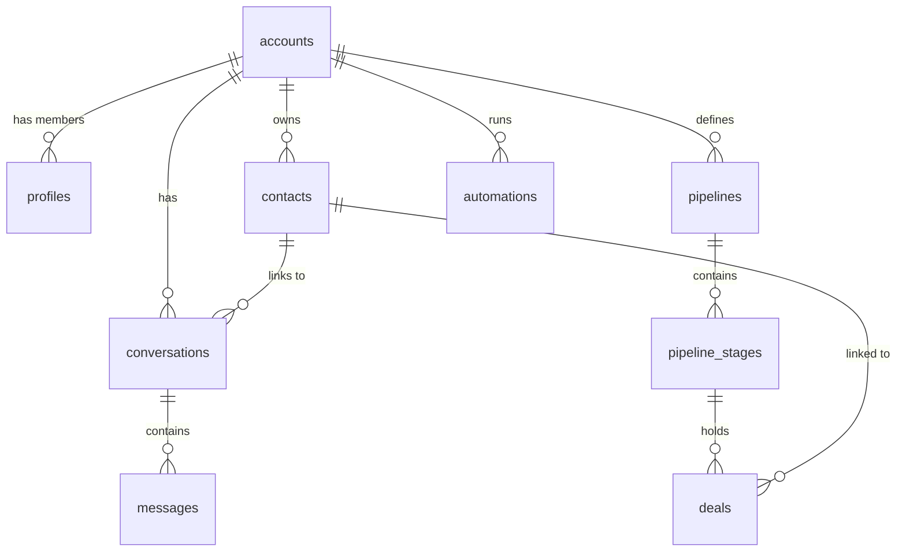
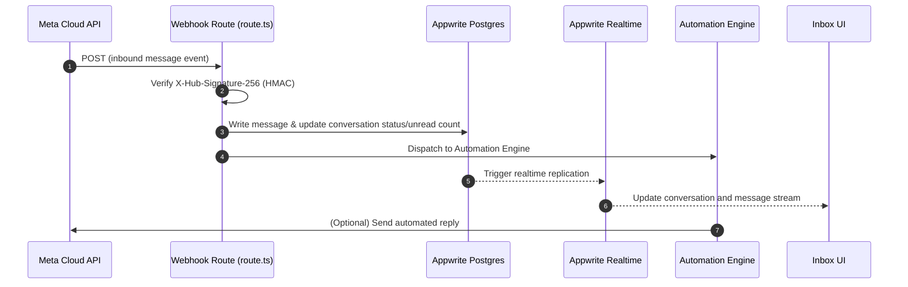

# Codebase Analysis: wacrm

`wacrm` is a self-hostable Customer Relationship Management (CRM) template designed specifically for WhatsApp®. It is built using Next.js 16 (App Router), React 19, Tailwind CSS v4, and Appwrite (Postgres, Auth, Storage, and RLS).

This document outlines the architecture, database schema, domain logic, and security features of the codebase.

---

## 1. Technical Stack Overview

| Layer | Technology | Description |
| :--- | :--- | :--- |
| **Framework** | [Next.js 16](https://nextjs.org) (App Router) | Handles application routing, server-side rendering, and API routes. |
| **Frontend UI** | [React 19](https://react.dev), [Tailwind CSS v4](https://tailwindcss.com) | Core UI library and styling framework. |
| **Components** | [shadcn/ui](https://ui.shadcn.com) & [@base-ui/react](https://base-ui.com) | Modular, styled UI components. |
| **Diagrams/Canvas** | [@xyflow/react](https://reactflow.dev) | Renders flowcharts and visual node graphs for Automations and Flows. |
| **Database & Auth** | [Appwrite](https://appwrite.com) (Postgres + GoTrue Auth) | Relational database, user authentication, Realtime sync, and Storage. |
| **API Integration** | WhatsApp Business Cloud API | Direct integration with Meta's official Cloud API. |
| **Testing** | [Vitest](https://vitest.dev) | Runs the unit and integration test suite. |

---

## 2. System Architecture & Directory Structure

The repository is structured logically by domain and layer:

*   **`appwrite/migrations/`**: Defines the SQL schema, security policies, triggers, and RPCs chronologically.
*   **`src/app/`**: Next.js pages and API route handlers.
    *   `src/app/(auth)/`: Handles sign-in, sign-up, and password recovery.
    *   `src/app/(dashboard)/`: Authenticated dashboard views (Inbox, Contacts, Pipelines, Broadcasts, Automations, Flows, Settings).
    *   `src/app/api/`: Back-end API endpoints. Webhook listener sits at `src/app/api/whatsapp/webhook/route.ts`.
*   **`src/components/`**: Reusable component packages grouped by domain page (`src/components/inbox/`, `src/components/automations/`, `src/components/flows/`).
*   **`src/lib/`**: Business logic, utility helper files, database clients, encryption keys, and third-party integrations (`src/lib/whatsapp/`, `src/lib/automations/`).
*   **`src/hooks/`**: React hooks for features like authentication (`use-auth.tsx`), broadcasts (`use-broadcast-sending.ts`), and real-time syncing (`use-realtime.ts`).
*   **`src/types/`**: Application type definitions. Main domain interfaces reside in `src/types/index.ts` and `src/types/database.ts`.

---

## 3. Database Schema & Multi-Tenancy

`wacrm` implements a **multi-tenant design** where records belong to an `Account` rather than an individual user. This allows teams to share one WhatsApp number and inbox.

### Database Schema Highlights

### Key Migrations
1.  **`001_initial_schema.sql`**: Setup of profiles, contacts, messages, conversations, and template tables.
2.  **`017_account_sharing.sql`**: Migrates the database into a multi-tenant model. Introduces `accounts`, `account_members`, and `account_invitations` tables, wrapping all entities with `account_id` foreign keys.
3.  **`018_account_member_rpcs.sql` & `019_invitation_rpcs.sql`**: Expose stored procedures (RPCs) to securely invite users, accept invitations, and manage roles within accounts.
4.  **`022_contact_phone_dedup.sql`**: Enforces phone number normalization and uniqueness constraints per account.

> [!IMPORTANT]
> The database strictly enforces Row-Level Security (RLS) on all tables. Queries must scope their operations through the current authenticated user's `account_id`, which is mapped inside the database using security policies.

---

## 4. Key Workflows

### Inbound Message Flow (Meta to Dashboard UI)

1.  **Webhook Validation**: The route [route.ts](file:///Users/susantalohar/Documents/wacrm/src/app/api/whatsapp/webhook/route.ts) validates HMAC-SHA256 headers using the configured `verify_token` or `app_secret`.
2.  **State Insertion**: Message content is parsed and saved to the database. Conversations are created dynamically or updated to set the latest message details and increment unread counts.
3.  **Automations & Flows**: If an active automation trigger matches the inbound message (e.g., keyword match or first inbound message), the [automations engine](file:///Users/susantalohar/Documents/wacrm/src/lib/automations/engine.ts) executes steps sequentially.

---

## 5. Domain Modules Detail

### 1. Shared Inbox
*   Found in [src/components/inbox/](file:///Users/susantalohar/Documents/wacrm/src/components/inbox) and [src/app/(dashboard)/inbox/](file:///Users/susantalohar/Documents/wacrm/src/app/(dashboard)/inbox).
*   Enables agent assignment (`assigned_agent_id`), conversation filters (open, pending, closed), and contact sidebar data editing (tags, notes, custom fields).
*   Message composer supports rich payloads (text, quick replies, templates, and media attachments).

### 2. No-Code Automations
*   Found in [src/lib/automations/](file:///Users/susantalohar/Documents/wacrm/src/lib/automations) and [src/components/automations/](file:///Users/susantalohar/Documents/wacrm/src/components/automations).
*   **Triggers**: message received, keyword match, contact created, time-based schedules, or tag additions.
*   **Steps**: send messages, send templates, add/remove tags, assign to agents, update fields, create deals, wait, branch conditions, or trigger outbound webhooks.

### 3. Visual Flows
*   Found in [src/components/flows/](file:///Users/susantalohar/Documents/wacrm/src/components/flows) and [src/lib/flows/](file:///Users/susantalohar/Documents/wacrm/src/lib/flows).
*   An advanced visual node builder using React Flow (`@xyflow/react`) to define step-by-step interactive message trees (menus, branches, media steps) sent to customers.

### 4. Sales Pipelines
*   Found in [src/components/pipelines/](file:///Users/susantalohar/Documents/wacrm/src/components/pipelines) and [src/app/(dashboard)/pipelines/](file:///Users/susantalohar/Documents/wacrm/src/app/(dashboard)/pipelines).
*   A Kanban board utilizing `@dnd-kit/core` and `@dnd-kit/sortable` to drag and drop deals across custom pipeline stages.

---

## 6. Security & Credentials Encryption

Credential storage is engineered defensively in `wacrm`:
*   **Meta Access Tokens**: Stored encrypted in the database.
*   **Encryption Scheme**: AES-256-GCM. The encryption key is sourced from the `ENCRYPTION_KEY` environment variable.
*   **Implementation**: See [encryption.ts](file:///Users/susantalohar/Documents/wacrm/src/lib/whatsapp/encryption.ts) which wraps Node's native `crypto` module.

> [!WARNING]
> If the `ENCRYPTION_KEY` env var is lost or rotated incorrectly, all previously stored WhatsApp configurations (specifically access tokens) will fail to decrypt, disabling webhook sync and outbound message capabilities.

---

## 7. Next Steps & Codebase Maintenance

*   **Type Safety**: The project uses strict TypeScript rules. Verify type compliance via `npm run typecheck`.
*   **Code Quality**: Lints are managed via ESLint. Run `npm run lint` for checks and `npm run format` to auto-format using Prettier.
*   **Testing**: Run `npm run test` to verify there are no regressions across core engines (Automations, Encryption, WhatsApp Meta-API client).
