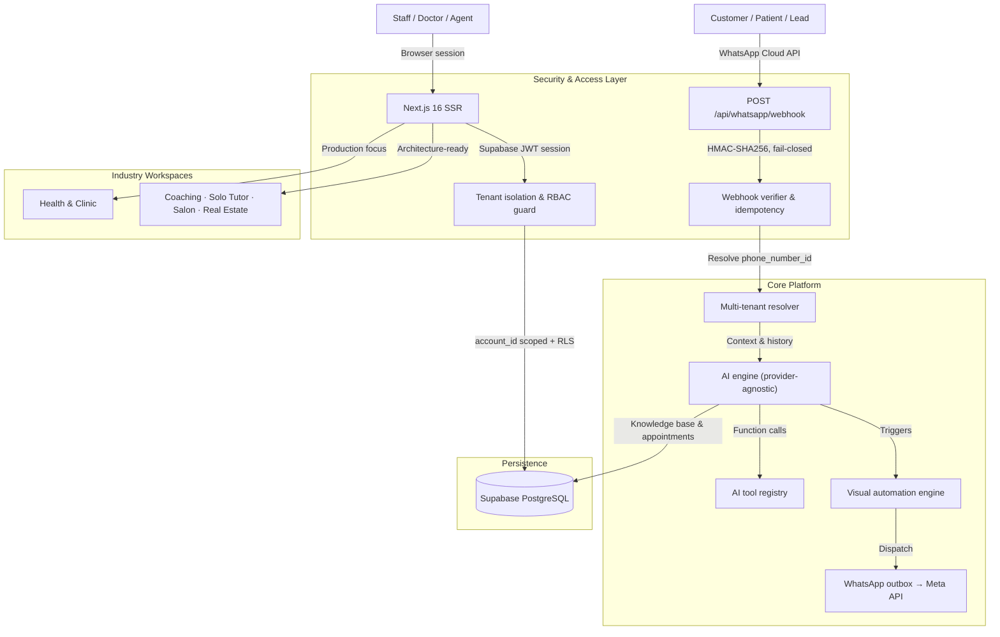

# Helpa Architecture

**Product:** Helpa — AI business communication platform and multi-tenant CRM
**Style:** Modular monolith with clean service boundaries
**Stack:** Next.js 16 (App Router) · React 19 · TypeScript (strict) · Supabase PostgreSQL + Auth · Meta WhatsApp Business Cloud API
**Dependency rule:** industry modules may import core; core must never import an industry module.

---

## 1. System overview



---

## 2. Core platform vs. industry modules

```
┌──────────────────────────────────────────────────────────────────────────────┐
│                            HELPA CORE PLATFORM                               │
│  Auth · Tenants · Workspace engine · WhatsApp Cloud API · Unified inbox       │
│  Contacts · AI engine · Knowledge base · Automations · Campaigns · Billing    │
│  Super admin · RBAC · Rate limiting · Sanitizers · Event bus                  │
└──────────────────────────────────────┬───────────────────────────────────────┘
                                       │ dynamic manifest binding
            ┌──────────────────────────┴──────────────────────────┐
            ▼                                                     ▼
┌───────────────────────────────┐                 ┌───────────────────────────────┐
│  HEALTH & CLINIC              │                 │  ADDITIONAL VERTICALS         │
│  (production focus)           │                 │  (architecture-ready)         │
│  • Patient IDs (PT-XXXXXX)    │                 │  • Coaching (admissions)      │
│  • Doctor rosters & slots     │                 │  • Solo tutor (batches)       │
│  • Signed OPD PDF slips       │                 │  • Salon (stylists & menu)    │
│  • Pathology report dispatch  │                 │  • Real estate (site visits)  │
└───────────────────────────────┘                 └───────────────────────────────┘
```

Service boundaries and per-subsystem data ownership are documented in
[core-platform-architecture.md](./core-platform-architecture.md).

---

## 3. Directory layout

| Path | Responsibility |
| --- | --- |
| `src/app/` | App Router pages, layouts, and `/api/*` route handlers |
| `src/core/` | Industry-agnostic platform code (AI, WhatsApp, auth, billing, security) |
| `src/modules/` | Industry manifests: `health`, `coaching`, `solo-teacher`, `salon`, `real-estate` |
| `src/components/` | Reusable UI (landing, inbox, kanban, settings, dashboard) |
| `src/lib/` | Low-level utilities: encryption, rate limiting, currency, data clients |
| `src/infrastructure/` | External adapters and process-level wiring |
| `src/tests/` | Vitest unit, module, security, and tenant-isolation suites |
| `e2e/` | Playwright end-to-end specs |
| `supabase/migrations/` | Deterministic SQL migrations with RLS policies |
| `scripts/` | Build metadata, worker, migration, and verification scripts |

---

## 4. Subsystem inventory

### Frontend
React 19 server components for layouts and metadata; client components for
interactive surfaces. State via hooks (`useAuth`, `useWorkspace`,
`useTotalUnread`), URL query params for filters, `sonner` for toasts.
Tailwind CSS v4 with design tokens and light/dark theming.

### Backend
Next.js route handlers on the Node runtime, following a
controller → service → repository pattern.

### Authentication & sessions
Supabase SSR auth with HttpOnly, `Secure`, `SameSite` cookies. User identity
resolves to `account_members`, which defines the workspace role
(`owner` > `admin` > `staff` > `viewer`).

### Multi-tenancy
Shared database with logical isolation:

- **API layer:** `assertTenantOwnership` in `src/core/security/tenant-guard.ts`
- **Database layer:** PostgreSQL RLS policies scoped through
  `auth.uid() → account_members.account_id`
- **Admin clients:** every service-role query still passes an explicit
  `.eq('account_id', accountId)` to prevent unbounded scans

### Workspace system
Industry manifests resolve in `src/modules/registry.ts` and
`src/hooks/use-workspace.ts`, switching navigation, dashboard cards,
terminology, and AI system prompts per account.

### WhatsApp integration
Meta Cloud API with 1-click Embedded Signup, text/interactive/list/document/
template messages, and an outbox queue with exponential backoff
(`src/lib/whatsapp/outbox-service.ts`).

### Webhooks & idempotency
`POST /api/whatsapp/webhook` enforces fail-closed HMAC-SHA256 verification of
`X-Hub-Signature-256`. Tenants resolve from `phone_number_id`
(`src/core/whatsapp/tenant-resolver.ts`). Processed events are recorded in a
durable idempotency registry with a dead-letter queue.

### AI engine
Provider-agnostic `AiProvider` interface with bounded retries and fallback
routing; a tool registry exposes appointment booking, clinic hours, doctor
lookup, and patient search. Details in
[ai-provider-architecture.md](./ai-provider-architecture.md).

### Data model
Core tables include `accounts`, `profiles`, `account_members`, `contacts`,
`conversations`, `messages`, `whatsapp_configs`, `whatsapp_outbox`,
`webhook_events`, `appointments`, `reminder_jobs`, and `audit_logs`, plus
industry extension tables such as `hospital_doctors`, `hospital_departments`,
`hospital_lab_reports`, `plans`, and `subscriptions`. Foreign keys cascade on
account deletion; hot paths are indexed on `(account_id, created_at)`.

### Security posture
AES-256-GCM encryption for credentials at rest, HMAC-signed short-lived
document tokens, recursive PII/PHI redaction in the structured logger,
`Cache-Control: private, no-store` on authenticated routes, and sliding-window
rate limits. See [security/](./security).

---

## 5. Known technical debt

| Item | Impact | Tracking |
| --- | --- | --- |
| Legacy Appwrite runtime and compatibility shim still present alongside Supabase | Two possible homes for every data-layer bug | [#82](https://github.com/imsusanta/helpa/issues/82) |
| Independent security assessment not yet completed | Compliance claims remain self-attested | [#81](https://github.com/imsusanta/helpa/issues/81) |
| Outcome metrics not yet instrumented or published | No external evidence of product results | [#83](https://github.com/imsusanta/helpa/issues/83) |
| Demo video and product screenshots missing | Buyers cannot evaluate without a call | [#84](https://github.com/imsusanta/helpa/issues/84) |
| Stale industry stubs in `src/modules/` beyond the five supported verticals | Dead code surface | — |
