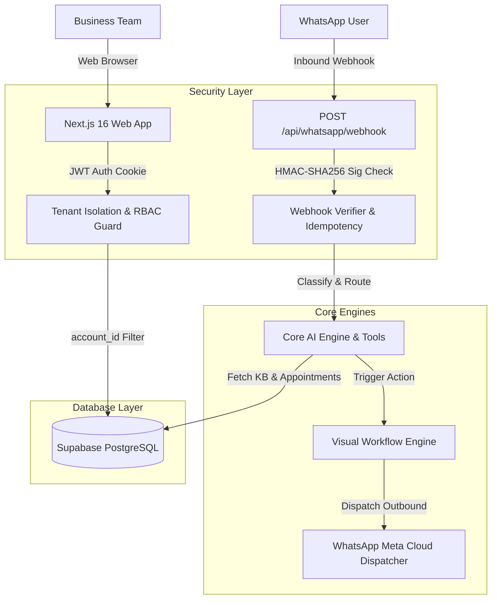

# Helpa Architecture & Multi-Tenant Blueprint

## System Overview

Helpa is an AI-powered WhatsApp communication and CRM platform designed for service and healthcare businesses.

---

## Key Subsystems

1. **Authentication & Session Management**:
   - Implemented via `@supabase/ssr` with HttpOnly, secure, SameSite cookies.
   - User identity maps to an `account_members` table that defines workspace roles (`owner`, `admin`, `staff`, `viewer`).

2. **Multi-Tenant Isolation**:
   - Strict database-level scoping (`account_id = ctx.accountId`).
   - Tenant guard (`src/core/security/tenant-guard.ts`) verifies resource ownership for every read/write.

3. **Provider Compatibility Layer**:
   - `src/lib/appwrite-server-compat.ts` provides a unified ORM-like interface for database operations, allowing PostgreSQL (Supabase) in production while preserving rollback compatibility.

4. **Meta WhatsApp Cloud Integration**:
   - 1-Click Embedded Signup via Facebook JavaScript SDK.
   - Dual-token AES-256-GCM encrypted persistence.
   - Bidirectional webhook synchronization with idempotency checks.
