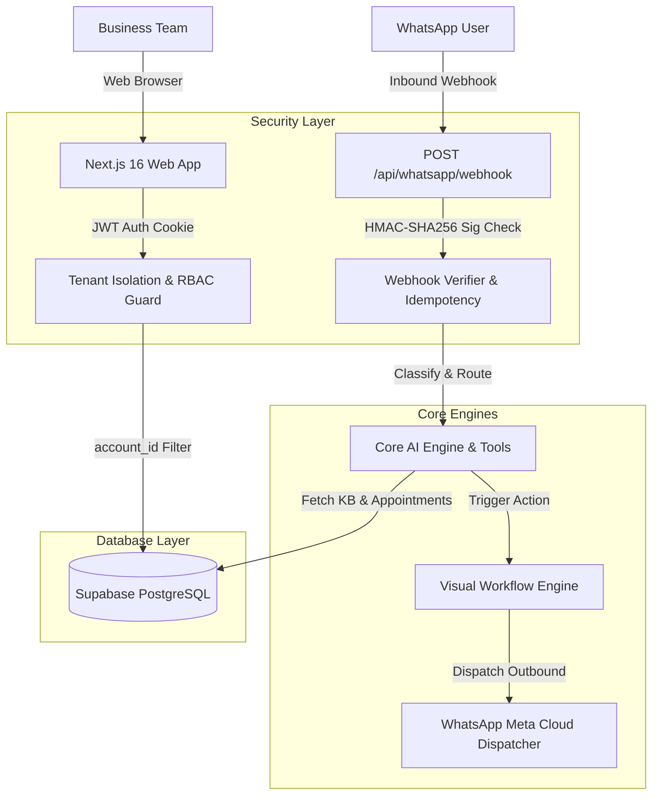

# Helpa Architecture & Multi-Tenant Blueprint

## System Overview

Helpa is an AI-powered WhatsApp communication and CRM platform designed for service and healthcare businesses.

---

## Key Subsystems

1. **Authentication & Session Management**:
   - Implemented via `@supabase/ssr` with HttpOnly, secure, SameSite cookies.
   - User identity maps to an `account_members` table that defines workspace roles (`owner`, `admin`, `staff`, `viewer`).

2. **Multi-Tenant Isolation**:
   - Strict database-level scoping (`account_id = ctx.accountId`).
   - Tenant guard (`src/core/security/tenant-guard.ts`) verifies resource ownership for every read/write.

3. **Database access**:
   - `src/lib/db/server.ts` and `src/lib/db/client.ts` return Supabase clients only, typed with the real Supabase client types so the query-builder chain is type-checked. There is no Appwrite rollback adapter.
   - Tenant-scoped repositories for trusted server flows live in `src/lib/db/repositories`.

3a. **AI receptionist pipeline** (`src/lib/whatsapp/`):
   - `ai.ts` — orchestrator (`triggerAiResponse`): fetch, safety guardrails, completion, hospital/coaching actions, reply dispatch.
   - `ai-pipeline.ts` — pure gating and insight extraction (skip decisions, phone variants, structured-payload mapping).
   - `ai-prompt.ts` — system prompt assembly and the receptionist JSON schema.
   - `ai-context.ts` — industry context loading/formatting (doctors, branches, appointments, lab reports, coaching students).
   - `ai-crm-sync.ts` — conversation insight columns and sales-pipeline deal sync.
   - `ai-response.ts` — tolerant model-output parsing.
   - Each helper module has its own unit tests; the orchestrator is covered end-to-end by `src/tests/whatsapp/ai-auto-reply-decision.test.ts`.

4. **Meta WhatsApp Cloud Integration**:
   - 1-Click Embedded Signup via Facebook JavaScript SDK.
   - Dual-token AES-256-GCM encrypted persistence.
   - Bidirectional webhook synchronization with idempotency checks.
