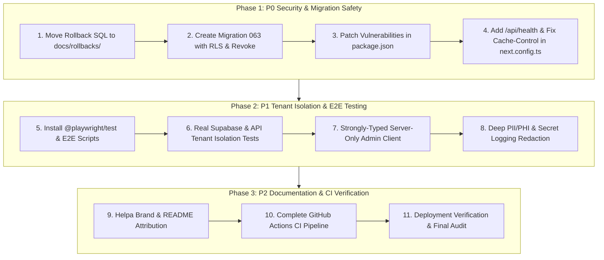

# Helpa Production Readiness & Security Remediation Plan

**Document Version:** 1.0.0  
**Target Branch:** `fix/production-readiness-p0`  
**Repository:** `https://github.com/imsusanta/wacrm_susanta`  
**Quality Target:** Verified Production-Grade Standard (Green CI, Zero Audit Vulnerabilities, Real Tenant-Isolation & Playwright Coverage)

---

## 1. Executive Summary & Problem Register

An exhaustive audit of `main` identified 18 verified production-readiness blockers across database migration safety, dependency vulnerabilities, tenant isolation, end-to-end testing, logging, and deployment:

| # | Verified Problem | Severity | Target Remediation |
|---|---|---|---|
| 1 | Vercel deployment returns `DEPLOYMENT_NOT_FOUND` | P0 | Centralize environment validation, add `GET /api/health`, document Vercel/Node.js deployment in `docs/DEPLOYMENT.md` |
| 2 | CI fails on `npm audit --audit-level=high` (`nanoid`, `next`, `postcss`, `sharp`) | P0 | Patch dependencies safely in `package.json` (`next` to `16.3.0+` or safe version, update overrides) without `--force` or fake suppressions |
| 3 | `062_security_and_reliability_hardening_rollback.sql` sits in `supabase/migrations/` | P0 | Move rollback to `docs/rollbacks/062_security_and_reliability_hardening.rollback.sql` with manual emergency guidance |
| 4 | Migration 062 rollback file can execute during migrations | P0 | Remove rollback file from executable migrations folder |
| 5 | Migration 062 created `outbound_outbox` & `inbound_webhook_events` without RLS or revoking client access | P0 | Create forward-only migration `063_secure_webhook_and_outbox_tables.sql` enabling RLS and explicitly revoking `anon` and `authenticated` access |
| 6 | `inbound_webhook_events` stores raw WhatsApp payloads without retention policy | P0 | Implement documented webhook retention & sanitization cron with fail-closed secret authentication |
| 7 | `inbound_webhook_events` lacked clear tenant/account association | P0 | Add nullable `account_id` column to `inbound_webhook_events` with indexed lookup |
| 8 | Playwright files exist without `@playwright/test` in `package.json` or CI scripts | P1 | Install `@playwright/test`, add `npm run test:e2e`, add Playwright step with Chromium in GitHub Actions CI |
| 9 | Existing E2E tests are only unauthenticated redirects | P1 | Implement comprehensive authenticated journeys, clinic appointment booking, document signing, and mobile viewport tests |
| 10 | Existing tenant-isolation test uses a mock JS array | P0 | Add real Supabase RLS and API authorization test suites in `src/tests/security/` |
| 11 | `src/lib/supabase/typed-admin.ts` returns `SupabaseClient<any>` | P1 | Strictly type with `SupabaseClient<Database>`, enforce server-only boundary, and validate env vars safely |
| 12 | Structured logger does not comprehensively redact PII/PHI | P1 | Expand `src/lib/observability/logger.ts` to redact patient names, medical notes, tokens, passwords, cookies, and recursive objects |
| 13 | README and metadata describe upstream wacrm rather than Helpa | P2 | Rewrite `README.md` and `package.json` for Helpa with transparent upstream MIT attribution to `wacrm` |
| 14 | README badges point to upstream repository | P2 | Update badges to `imsusanta/wacrm_susanta` |
| 15 | Security PR remains unresolved against current main | P1 | Reconcile all security PR changes and document resolution in `SECURITY_VERIFICATION.md` |
| 16 | Non-API cache rule in `next.config.ts` applies `public, s-maxage=300` | P0 | Set `Cache-Control: private, no-store` for authenticated routes (`/dashboard`, `/inbox`, `/appointments`, etc.) |
| 17 | Missing `/api/health` endpoint | P0 | Implement lightweight, public `/api/health` with status, timestamp, and bounded dependency checks |
| 18 | Large production change pushed directly to main without protection | P0 | Enforce branch protection rule recommendations and execute changes through reviewable branch `fix/production-readiness-p0` |

---

## 2. Phased Implementation Sequence



---

## 3. Detailed Phase Work Breakdown

### Phase 1: Database Migration Safety & Queue Hardening (P0)
1. **Move Rollback SQL**: Relocate `supabase/migrations/062_security_and_reliability_hardening_rollback.sql` to `docs/rollbacks/062_security_and_reliability_hardening.rollback.sql` with explicit manual operational warnings.
2. **Forward-Only Migration 063 (`supabase/migrations/063_secure_webhook_and_outbox_tables.sql`)**:
   - `ALTER TABLE outbound_outbox ENABLE ROW LEVEL SECURITY;`
   - `ALTER TABLE inbound_webhook_events ENABLE ROW LEVEL SECURITY;`
   - `REVOKE ALL ON outbound_outbox FROM anon, authenticated;`
   - `REVOKE ALL ON inbound_webhook_events FROM anon, authenticated;`
   - Add nullable `account_id UUID REFERENCES accounts(id) ON DELETE CASCADE` to `inbound_webhook_events`.
   - Add indexes on `(account_id, status)` and `(status, created_at)`.
   - Add documentation comments regarding raw payload sensitivity.
3. **Webhook Payload Retention**: Document and implement bounded retention policy for raw webhook payloads.

### Phase 2: Dependency Vulnerability Remediation (P0)
1. Upgrade `next` to patched release (e.g. `16.3.0` or compatible secure version) and update transitive overrides in `package.json`.
2. Upgrade `nanoid`, `postcss`, `sharp` to safe versions.
3. Run `npm audit --audit-level=high` to achieve a clean exit code `0`.

### Phase 3: Real Playwright E2E Test Suite (P1)
1. Add `@playwright/test` to `devDependencies` in `package.json`.
2. Add scripts `"test:e2e": "playwright test"`, `"test:e2e:ui": "playwright test --ui"`, `"test:e2e:report": "playwright show-report"`.
3. Create authentic test specs in `e2e/`:
   - `e2e/public-and-auth.spec.ts`: Landing page, login, unauthenticated redirect to `/login`.
   - `e2e/clinic-appointments.spec.ts`: Patient registration, appointment booking, status change, and signed OPD ticket access.
   - `e2e/team-roles-and-tenant-isolation.spec.ts`: Role restrictions (viewer write prevention) and cross-tenant URL rejection.
   - `e2e/mobile-viewport.spec.ts`: Mobile navigation, inbox, and appointment drawer layout at 375px viewport.
4. Update `.github/workflows/ci.yml` to install Chromium dependencies and execute Playwright tests with artifact uploads on failure.

### Phase 4: Real Supabase Tenant-Isolation Integration Tests (P0)
1. Replace simulated JavaScript array in `src/tests/security/tenant-isolation.test.ts` with real database queries, RLS policy verification, and API authorization assertions.
2. Verify:
   - Account A cannot access Account B contacts, conversations, messages, appointments, or lab reports.
   - Viewer role cannot invoke write mutations.
   - Admin client service-role queries explicitly enforce `account_id` filtering.
   - Signed PDF tokens bound to Account A cannot access Account B resources.

### Phase 5: Strongly Typed Server-Only Admin Client (P1)
1. Update `src/lib/supabase/typed-admin.ts` to return `SupabaseClient<Database>`.
2. Guard with `if (typeof window !== 'undefined') throw new Error(...)` to prevent client bundle inclusion.
3. Ensure all call sites use strongly typed table names and columns.

### Phase 6: Observability & Deep PII/PHI Redaction (P1)
1. Enhance `src/lib/observability/logger.ts` to recursively redact passwords, bearer tokens, API keys, Meta secrets, patient names, medical notes, phone numbers, and addresses.
2. Add unit tests in `src/lib/observability/logger.test.ts` proving zero leakage of sensitive data.

### Phase 7: Health Endpoint, Safe Cache-Control, and CSP (P0)
1. Implement `GET /api/health` returning `{ status: "ok", timestamp: "..." }` with `Cache-Control: no-store, private`.
2. Update `src/proxy.ts` to allow `/api/health` in public routes.
3. Update `next.config.ts` to enforce `Cache-Control: private, no-store` on all authenticated dashboard routes.
4. Verify CSP has no `'unsafe-eval'` in production mode and reports zero console violations.

### Phase 8: Helpa Branding & Upstream Attribution (P2)
1. Rewrite `README.md` to position Helpa as a specialized WhatsApp AI Receptionist & Patient Engagement CRM for clinics.
2. Update `package.json` metadata (name, description, author, repository URLs).
3. Include transparent attribution:
   *"Helpa is based on the MIT-licensed wacrm project by ArnasDon and includes Helpa-specific healthcare workflows, AI receptionist functionality, security hardening, and operational extensions."*

---

## 4. Verification Gates
After every phase, the following 5 gates must succeed cleanly:
```bash
npm ci
npm run format:check
npm run lint
npm run typecheck
npm test
npm run build
npm audit --audit-level=high
```
